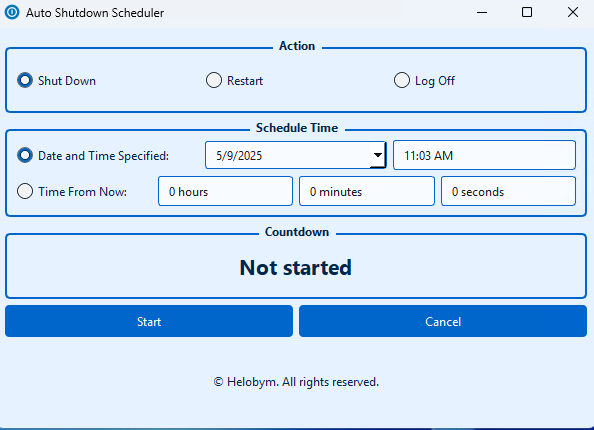

This software is developed by [Helobym](https://helobym.com)

Auto Shutdown Scheduler is a Windows utility application designed to help users automate computer shutdown, restart, and logoff operations at specified times.

[Demo Video](https://youtu.be/ugxc0ppeY-s)

